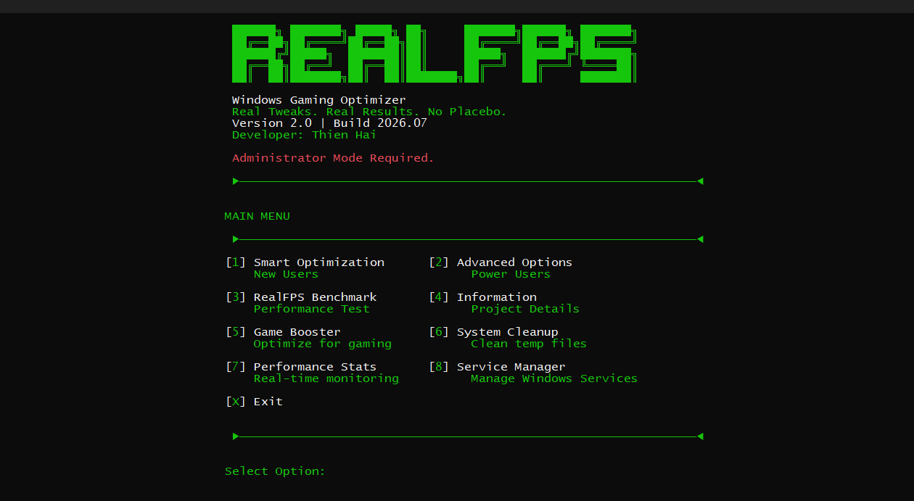
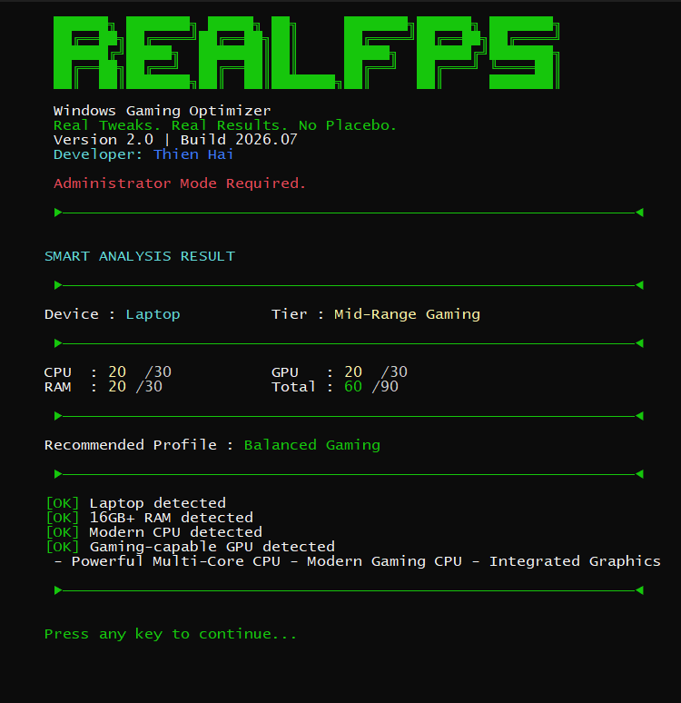
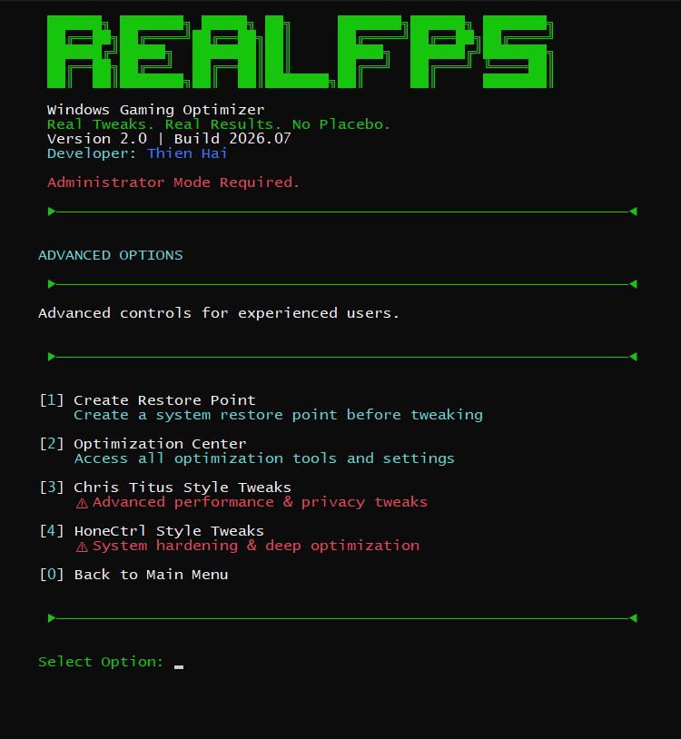

<h1 align="center">
RealFPS
</h1>

  

<h2 align="center">
Windows Gaming Optimizer
</h2>

⚡ Real Tweaks • 📊 Real Results • 🚫 No Placebo

---

# 👋 About

Hi, I'm Hải — a Graphic Design student with a passion for technology, software development, and system optimization.

RealFPS started from my curiosity about Windows internals and my goal of creating a transparent optimization tool instead of relying only on existing solutions.

Although my background is design, I learned programming and system automation to build RealFPS with AI assistance as a development partner.

This project combines:

> Design Thinking + AI Assistance + Programming = RealFPS

---

# 🎮 What is RealFPS?

RealFPS is a Windows Gaming Optimizer built with Batch Script.

The goal is simple:

> Optimize Windows performance through measurable changes, not random tweaks.

RealFPS focuses on:

| Category | Description |
|---|---|
| ⚡ Performance | Power plan and system performance tuning |
| 🎮 Gaming | Game Mode, Xbox DVR, gaming profiles |
| 🌐 Network | Network optimization settings |
| 🧹 Cleanup | Temporary file and cache cleanup |
| 📊 Analysis | Hardware detection and system reports |
| 🛠 Control | User-controlled Windows adjustments |

---

# 📸 Preview

  

Main Dashboard

  
  

System Analysis & Optimization Center

---

# 🚀 Philosophy

Many Windows optimization tools rely on:

❌ Fake FPS promises  
❌ Random registry modifications  
❌ Unsafe system changes  
❌ No recovery system  

RealFPS follows:

✅ Transparent optimizations  
✅ User-controlled changes  
✅ Restore-friendly workflow  
✅ Measurable improvements  

> Only measurable optimizations.

---

# ✨ Features

| Category | Features |
|---|---|
| 🎯 Gaming | Game Mode, Xbox DVR, Gaming Pack |
| ⚡ Power | Ultimate Performance, High Performance, Balanced |
| 🌐 Network | Network optimization and restore |
| 🛠 System | Hardware analysis, cleanup, restore point |
| 📦 Profiles | Competitive, Balanced, Battery |
| 🔧 Advanced | Chris Titus Style & HoneCtrl Style Tweaks |

---

# 📚 Documentation

Complete technical documentation:

| Document | Description |
|---|---|
| 📖 [Lifecycle](docs/lifecycle.md) | Full RealFPS execution lifecycle |
| ⚙️ [Execution Flow](docs/execution-flow.md) | Runtime process and routing system |
| 🏗️ [Architecture](docs/architecture.md) | Internal project structure |

## Modules

| Module | Description |
|---|---|
| ⚡ Smart Optimization | Automatic analysis and optimization |
| 🎛 Optimization Center | Manual system controls |
| 🎮 Game Booster | Gaming performance profile |
| 📊 Benchmark | Hardware performance analysis |
| 🧹 System Cleanup | Temporary file cleanup |
| 🔧 Service Manager | Windows service control |
| 🚀 Chris Titus Tweaks | Performance and privacy tweaks |
| 🔥 HoneCtrl Tweaks | Advanced optimization profiles |

---

# 🧠 Inspiration & References

RealFPS is an independent project built from scratch.

The project was inspired by optimization concepts from:

## Chris Titus Tech Windows Utility

Inspired concepts:

- Windows management workflow
- Cleanup approach
- User-controlled optimization

## HoneCtrl / Gaming Optimization Tools

Inspired concepts:

- Gaming optimization workflow
- Simple user experience
- Performance-focused tuning

RealFPS does not copy:

❌ Source code  
❌ UI design  
❌ Proprietary components  

All scripts, logic, and features are independently developed.

---

# 🏗️ Development

RealFPS is developed using:

| Technology | Purpose |
|---|---|
| Batch Script | Windows automation |
| PowerShell | System information and commands |
| AI Assistant | Development support |
| GitHub | Version control |
| Windows Testing | Validation environment |

---

# 📌 Roadmap

| Status | Feature |
|---|---|
| ✅ | Environment Check |
| ✅ | Welcome System |
| ✅ | Agreement System |
| ✅ | System Analysis |
| ✅ | Restore Point |
| 🔄 | Optimization Center V2 |
| 🔄 | Complete UI Redesign |
| 🔄 | More measurable tweaks |
| 🔄 | Advanced Optimization Lab |
| 🔄 | RealFPS Profile System |

---

# ⭐ Support RealFPS

If you find RealFPS useful:

⭐ Star this repository  
🐛 Report bugs  
💡 Suggest improvements  
🤝 Share feedback  

---

Built with curiosity, AI, and passion.

 

<b>Real Tweaks. Real Results. No Placebo.</b>

