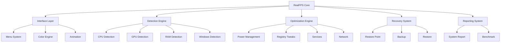

# RealFPS Architecture

> Internal structure of RealFPS Windows Gaming Optimizer.

---

## Architecture Overview



---

## Core Design

RealFPS follows:

```
User
 |
Interface
 |
Router
 |
Module
 |
System API
 |
Windows
```

---

## Main Components

| Component | Purpose |
|-|-|
| Core Engine | Controls execution |
| UI Engine | Handles CMD interface |
| Detection Engine | Reads hardware |
| Optimization Engine | Applies tweaks |
| Recovery System | Protects user |
| Report System | Shows results |
